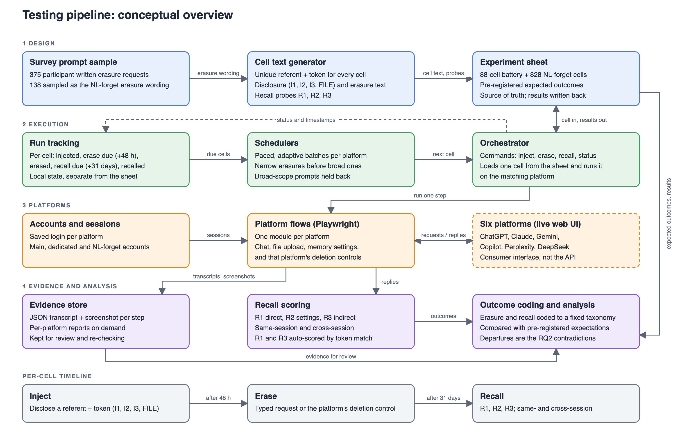

# Testing pipeline overview

| Component | Where it lives |
|---|---|
| Survey prompt sample | `data/nl_forget_prompts_138_final.csv` |
| Cell text generator | `token_generator.py`, `nl_forget_cell_generator.py` |
| Experiment sheet | `data/RTBF Experiments.xlsx` (MASTER, FILE SUBSTUDY, NL FORGET); runbooks `token.md`, `recall_probes.md` |
| Run tracking | `../tester/tracking.py`, `../tester/data/run_tracking.json` |
| Schedulers | `../tester/nl_forget_round_robin_scheduler.py` (injection), `../tester/erasure_scheduler.py` (erasure) |
| Orchestrator | `../tester/run_cell.py` |
| Accounts and sessions | `../tester/config.py`, `../tester/accounts.md`, `../tester/sessions/` |
| Platform flows | `../tester/flows/` |
| Evidence store | `../tester/transcripts/`, `../tester/generate_platform_reports.py` |
| Recall scoring | `../tester/run_cell.py` (recall), probe text from `recall_probes.md` via `../tester/recall_probes_loader.py` |
| Outcome coding and analysis | Expected outcomes are in the sheet; runs after recall opens (from 2026-10-01) |
